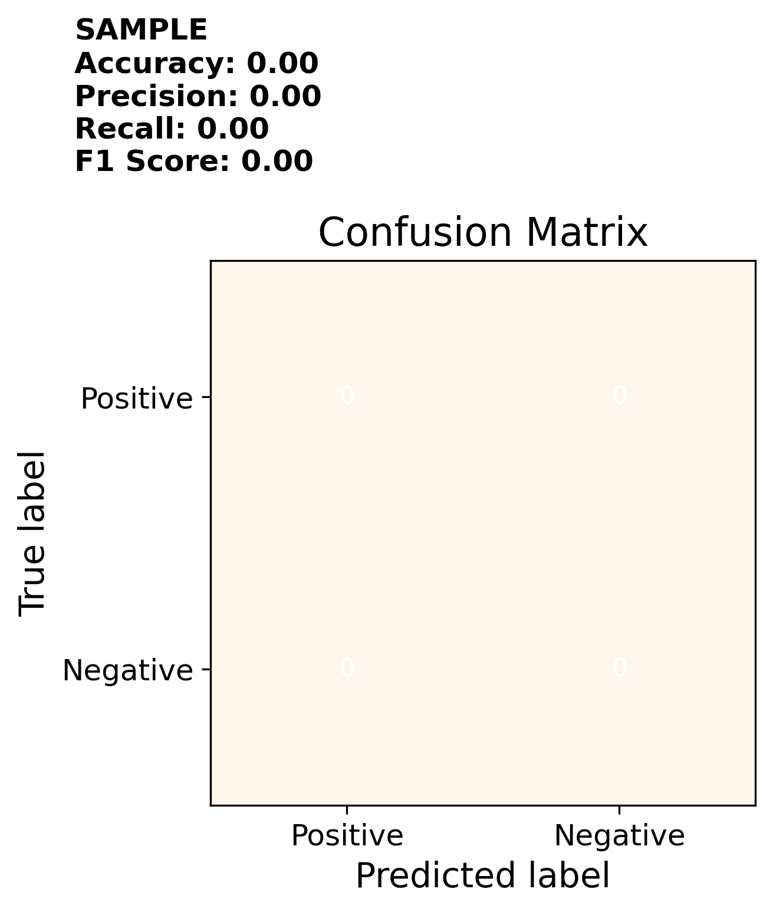

# Nzema POS Tagger

- Godfred Agyapong
- Jose Cabrera

This is a Python-based Parts of Speech (POS) Tagger for the Nzema language. The POS Tagger is designed to identify the various parts of speech in a given text document and classify them accordingly.

## Dependencies
The following dependencies are required to run the POS Tagger:
* nltk
* bs4
* matplotlib

## Installation
To install the required dependencies, you can use the following command:
```
pip3 install nltk bs4 matplotlib
```

## Usage
To use the POS Tagger, you can run the `main.py` file. 

Example usage:
```
python3 main.py
```

## Output
The output of the POS Tagger will be found on the `data/plots` folder. It will consist of confusion matrices with evaluation metrics on the top-left corner, as follows:



## Additional information

This project is part of the LIN4770C/LIN57770C Introduction to Computational Linguistics class for the Spring 2023 semester at the University of Florida.

## Acknowledgments

Acknowledgements to

- Dr. Zoey Liu for her guidance in this project
- Andrea Abban, Francis, and Sandra Asiedu Menlah for helping with the annotation of the training and testing data.